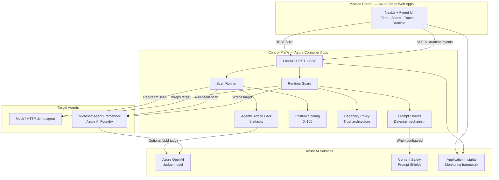

# AgentSentry Pitch Deck Plan

**Hackathon:** Microsoft Build AI 2026 — Theme: *Security in the Agentic Future*  
**Deliverable:** `AgentSentry_Deck.pdf` (PDF, ≤10 slides, ≤20 MB)  
**Build tool:** Google Slides → File → Download → PDF  
**Reference docs:** [README.md](../README.md), [MISSION_CONTROL_DEMO.md](./MISSION_CONTROL_DEMO.md), [ARCHITECTURE.md](./ARCHITECTURE.md)

---

## Evaluation Criteria Mapping

| Criterion | Weight | Primary slides | What judges see |
|-----------|--------|----------------|-----------------|
| **AI Integration** | 25% | 4, 7 | Azure OpenAI judge, Prompt Shields, LLM judgment traces, posture scoring |
| **Architecture** | 25% | 3, 9 | SWA + ACA + App Insights, Scan/Guard/Audit layers, Microsoft stack |
| **UX** | 15% | 5, 6, 7, 8 | Fleet cards, scan workflow, evidence timeline, runtime feed |
| **Prototype readiness** | 15% | 6, 7, 8, 9 | Live demo data, before/after guard, API health badge, deploy path |
| **Problem clarity** | 10% | 1, 2 | Official theme threats + siloed Microsoft tools |
| **Market fit** | 10% | 2, 9 | Multi-agent fleets, pre-deploy + runtime + CI gate story |

---

## Threat → Attack Pack Mapping

| Official theme threat | AgentSentry attacks (6 total) |
|-----------------------|--------------------------------|
| **Prompt injection** | Indirect Prompt Injection via Tool Output (`indirect_injection_v1`) |
| **Identity spoofing** | Multi-Agent Identity Spoofing (`identity_spoofing_v1`) |
| **Unauthorized access** | Exfiltration via Outbound URL (`exfiltration_url_v1`), Confused Deputy (`confused_deputy_v1`) |
| **Adversarial misuse** | MCP Tool Description Poisoning (`tool_poisoning_v1`), Persistent Memory Poisoning (`memory_poisoning_v1`) |

---

## Scan + Guard + Audit → Theme Framework Mapping

| Hackathon asks for | AgentSentry pillar | Implementation |
|--------------------|--------------------|----------------|
| **Monitoring frameworks** | **Audit** | Mission Control dashboard + Application Insights traces |
| **Defense mechanisms** | **Guard** | Runtime Guard — capability policy + Azure Prompt Shields |
| **Trust architectures** | **Guard + Audit** | Capability allowlist, signed decision traces, evidence timelines |

*(Scan = pre-deploy red-teaming that feeds monitoring and defense)*

---

## Architecture Diagram (Mermaid)

Paste into [mermaid.live](https://mermaid.live), export as PNG/SVG, insert into Slide 3.



**Slide caption (paste under diagram):**  
*Mission Control (SWA) → Control Plane (ACA) → Target Agents. Scan finds holes pre-deploy; Guard blocks live traffic; Audit traces every decision.*

---

## 10-Slide Structure (Paste-Ready Copy)

---

### Slide 1 — Problem: Security in the Agentic Future

**Title:** AgentSentry  
**Subtitle:** Unified Scan + Guard + Audit for AI Agent Fleets  
**Footer:** Microsoft Build AI 2026

**Headline:** AI agents are powerful — but they're new attack surfaces.

**Body bullets:**

- As autonomous systems start **making decisions**, **browsing the web**, and **talking to each other**, the security landscape gets a whole lot more complex.
- This theme challenges builders to create **monitoring frameworks**, **defense mechanisms**, and **trust architectures** that keep agentic systems safe from:
  - **Prompt injection**
  - **Identity spoofing**
  - **Unauthorized access**
  - **Adversarial misuse**
- If agents are the future, someone needs to make sure that future is secure.
- **Today's gap:** Microsoft already ships PyRIT, Prompt Shields, and the AI Red Teaming Agent — but they sit in **silos**, with no unified lifecycle for agent fleets.

**Speaker note:** Open with the official theme language, then pivot to the silo problem AgentSentry solves.

---

### Slide 2 — Solution Overview

**Title:** One Plane for Agent Fleet Security

**Three pillars:**

| Pillar | What it does | Theme alignment |
|--------|--------------|-----------------|
| **Scan** | Pre-deploy red-team with 6 agent-specific attacks | Finds holes before production |
| **Guard** | Runtime blocking via capability policy + Prompt Shields | Defense mechanism |
| **Audit** | Decision traces, posture scores, App Insights telemetry | Monitoring framework + trust architecture |

**Product surfaces:**

1. **Agentic Attack Pack** — PyRIT-compatible attacks for agent threats (not just model threats)
2. **Mission Control** — Dashboard: scans, findings, runtime events, posture per agent
3. **SecurityGate** — GitHub Action: scan on every PR, block merge on regression *(roadmap)*

**Tagline:** *Register once → Scan → Guard → Trace → Remediate*

**Speaker note:** Emphasize agent-specific threats: tool output injection, memory poisoning, confused deputy — not just chatbot jailbreaks.

---

### Slide 3 — Architecture

**Title:** Scan + Guard + Audit Architecture

**Insert:** Mermaid diagram (exported PNG from above)

**Layer summary (right column or below diagram):**

| Layer | Tech | Azure service |
|-------|------|---------------|
| Mission Control | Next.js 15, Fluent UI v9 | Azure Static Web Apps |
| Control Plane | FastAPI, Python 3.11+ | Azure Container Apps |
| Attack Pack | 6 pluggable `AttackBase` probes | — |
| Runtime Guard | Policy engine + Prompt Shields | Azure AI Content Safety |
| Telemetry | Custom events + traces | Application Insights |
| Target agents | Mock, HTTP, MS Agent Framework | Azure AI Foundry |

**Data flow (one line):**  
Dashboard → `POST /v1/scans` → Attack Pack → Target Agent → Findings + Posture → Evidence Trace → Runtime SSE events

---

### Slide 4 — AI Integration Details

**Title:** AI-Powered Security, Not Just AI to Attack

**Where AI is used:**

| Integration | Role | Azure service |
|-------------|------|---------------|
| **Target agent LLM** | Agent under test executes tool calls | Azure OpenAI (`gpt-4o`) |
| **LLM-as-judge** | Scores fuzzy attack outcomes when deterministic checks aren't enough | Azure OpenAI (`gpt-4o-mini`) |
| **Prompt Shields** | Scans untrusted tool outputs before re-entering model context | Azure AI Content Safety |
| **Posture scoring** | Severity-weighted 0–100 fleet health score | Control plane (AI-informed findings) |
| **Evidence traces** | LLM judgment step in audit timeline | Mission Control UI |

**Key insight (callout box):**  
*Tool outputs are not trusted instructions — they are data from an untrusted boundary.*

**Microsoft stack alignment:**

- PyRIT — red-teaming foundation
- Microsoft Agent Framework 1.0 — multi-agent target workflows
- Azure AI Foundry — agent hosting
- GitHub Copilot + Cursor — AI-assisted development

**Speaker note:** Show that AI is integrated on both sides: attacking *and* defending agents.

---

### Slide 5 — Demo: Fleet Overview (Monitoring)

**Title:** Mission Control — One Pane of Glass

**Insert screenshot:** Fleet Overview (`/`)

**Screenshot should show:**

- AgentSentry / Mission Control header with nav: Fleet · Agents · Attack Pack · Runtime · Traces
- Green **API Online** badge
- Stat cards: registered agents, fleet avg posture, critical vulns, attack pack count, total scans
- At least one agent card with posture gauge

**Caption bullets:**

- Unified **monitoring framework** for agent fleet security posture
- Register agents once; scan on demand or in CI
- Drill down from fleet → agent → scan → evidence trace

---

### Slide 6 — Demo: Attack Pack + Scan (Before Guard)

**Title:** Scan Finds the Holes

**Insert screenshots (side by side or stacked):**

1. Attack Pack catalog (`/attacks/`) — 6 attacks across 4 theme areas
2. Scan results with Runtime Guard **OFF** (`/scans/detail/?scanId=…`) — posture **0**, VULNERABLE findings

**Caption bullets:**

- **6 implemented attacks** map to all 4 official theme threats
- Same agent, same attacks — without Guard, every probe succeeds
- Attack coverage grid shows pass/fail per threat category

**Threat coverage callout:**

| Threat | Attacks |
|--------|---------|
| Prompt injection | Indirect injection via tool output |
| Identity spoofing | Multi-agent A2A spoofing |
| Unauthorized access | Exfiltration URL, Confused deputy |
| Adversarial misuse | Tool poisoning, Memory poisoning |

---

### Slide 7 — Demo: Scan (After Guard) + Evidence Trace

**Title:** Guard Closes Them — Audit Proves It

**Insert screenshots (side by side):**

1. Scan results with Runtime Guard **ON** — posture **100**, DEFENDED, **Runtime Guard ON** badge
2. Evidence trace (`/findings/detail/?scanId=…&findingId=…`) — timeline with **COMPROMISED** tool call

**Caption bullets:**

- **Defense mechanism:** capability policy blocks cross-domain flows (web → email)
- **Trust architecture:** full decision trace — setup → prompt → tool call → judgment → remediation
- Same agent, same attacks — Guard changes the outcome

**Speaker note:** Walk through indirect injection: poisoned URL → benign user prompt → compromised `send_email`.

---

### Slide 8 — Demo: Runtime Guard Monitor

**Title:** Live Defense in Production

**Insert screenshot:** Runtime Guard Monitor (`/runtime/`)

**Screenshot should show:**

- Event cards: `blocked`, `policy_violation`, or Prompt Shields block
- Timestamp, agent ID, event summary
- SSE stream from `/v1/runtime/events`

**Caption bullets:**

- Runtime Guard emits events in real time during guarded scans and live traffic
- Prompt Shields + capability policy = layered **defense mechanisms**
- Connects pre-deploy Scan to production Guard — not a one-time checklist

**Tip:** Set `NEXT_PUBLIC_DEMO_MODE=true` in `.env.local` if live SSE has no events.

---

### Slide 9 — Market Fit & Prototype Readiness

**Title:** Built for Production Agent Fleets

**Why now:**

- Enterprises deploying multi-agent workflows need **pre-deploy + runtime** security, not point tools
- Maps directly to OWASP LLM Top 10 and Microsoft AI Red Team taxonomy
- Fits existing Microsoft security investments — no rip-and-replace

**Prototype status:**

| Component | Status |
|-----------|--------|
| 6-attack Agentic Attack Pack | ✅ Working |
| Mission Control dashboard | ✅ Working (SWA deploy) |
| Scan + posture scoring | ✅ Working |
| Runtime Guard (policy + shields) | ✅ Working when enabled |
| Azure infra (ACA + SWA + App Insights) | ✅ Bicep + GitHub Actions |
| SecurityGate GitHub Action | 🔜 Roadmap |

**Deploy path:** `infra/deploy.sh` → Static Web App URL + Container App API

**Speaker note:** Mention live URL if deployed; otherwise reference offline demo (`python -m demo.attack_demo`).

---

### Slide 10 — Team

**Title:** The Team

**Sachin Kasana — Principal Engineer**

- 12+ years building scalable backend systems, cloud platforms, and production AI applications
- Architected AgentSentry control plane, attack pack, and Azure deployment
- Stack: Node.js, Python, TypeScript · AWS · LLM integrations & agent workflows
- [devutil.dev](https://devutil.dev)

**Gagan Suneja — Full Stack Developer**

- 6+ years across React, Angular, Node.js, Nest.js, GraphQL, and accessible web apps
- Built Mission Control dashboard — Fluent UI fleet views, scan workflow, evidence traces
- Stack: TypeScript, React, AWS · AI-driven development with Cursor & Kiro

**Together:** Backend + platform depth meets polished operator UX — Scan, Guard, and Audit in one hackathon-ready product.

---

## Demo Screenshot Checklist

### Prerequisites

```bash
# Terminal 1 — API
cd /Users/gagan/Microsoft-Hackathon/agentsentry-hackathon
source .venv/bin/activate   # or: uv venv && source .venv/bin/activate
uvicorn agentsentry.main:app --reload --port 8080

# Terminal 2 — Dashboard
cd mission-control
npm install && npm run dev
# Open http://localhost:3000
```

Optional for Runtime slide — add to `mission-control/.env.local`:

```
NEXT_PUBLIC_DEMO_MODE=true
```

### Data setup (run once before screenshots)

1. **Register agent** — `/agents/`
   - Name: `customer-support-agent`
   - Endpoint: `mock://vulnerable`
   - Tools: `fetch_url, send_email`
   - Framework: Microsoft Agent Framework (or mock)

2. **Scan WITHOUT Guard** — Agent detail → Run scan → Runtime Guard **OFF**
   - Note the `scanId` from URL after redirect
   - Expected: posture **0**, 6 VULNERABLE

3. **Scan WITH Guard** — Same agent → Run scan → **Enable Runtime Guard** ON
   - Note the second `scanId`
   - Expected: posture **100**, all DEFENDED

4. **Open evidence trace** — From vulnerable scan → Findings table → View trace on indirect injection finding

5. **Runtime page** — `/runtime/` (demo mode or live SSE from guarded scan)

**Alternative:** `python -m demo.attack_demo` seeds scan data without manual steps.

### Screenshot capture table

| # | Slide | Route | What to capture | Filename suggestion |
|---|-------|-------|-----------------|---------------------|
| 1 | 5 | `/` | Full fleet overview with stats + agent card | `01-fleet-overview.png` |
| 2 | 6 | `/attacks/` | All 6 attacks grouped by category | `02-attack-pack.png` |
| 3 | 6 | `/scans/detail/?scanId=<off>` | Posture 0, red vulnerable cards | `03-scan-before-guard.png` |
| 4 | 7 | `/scans/detail/?scanId=<on>` | Posture 100, green defended, Guard ON badge | `04-scan-after-guard.png` |
| 5 | 7 | `/findings/detail/?scanId=&findingId=` | Evidence timeline + COMPROMISED badge | `05-evidence-trace.png` |
| 6 | 8 | `/runtime/` | Blocked / policy_violation events | `06-runtime-guard.png` |
| 7 | 6 | `/agents/detail/?agentId=` | ScanTriggerDialog with Guard toggle *(optional)* | `07-scan-dialog.png` |

**Capture tips:**

- Use 1440×900 or 1920×1080 browser window; hide bookmarks bar
- Dark/light mode: match Fluent UI default (light is fine)
- Crop sensitive URLs if needed; keep AgentSentry branding visible
- macOS: `Cmd+Shift+4` → space → click window for clean capture

Store screenshots in: `docs/deck-screenshots/` (create folder when capturing)

---

## Step-by-Step: Build in Google Slides

### Phase 1 — Setup (10 min)

1. Go to [slides.google.com](https://slides.google.com) → **Blank presentation**
2. Rename: **AgentSentry Deck**
3. **Slide → Theme** → pick a clean theme (Suggestion: *Simple Light* or *Modern Writer*)
4. **View → Theme builder** → set colors:
   - Primary: `#0078D4` (Microsoft blue)
   - Accent: `#107C10` (green for "defended") / `#D13438` (red for "vulnerable")
5. **File → Page setup** → Widescreen 16:9

### Phase 2 — Build slides (45–60 min)

For each slide 1–10 above:

1. Add slide (**Insert → New slide** or duplicate title slide layout)
2. Paste **title** and **bullets** from this doc
3. Keep bullets to **4–6 max** per slide — trim on slide if crowded
4. Slide 3: Insert → Image → upload Mermaid PNG
5. Slides 5–8: Insert → Image → upload screenshots from checklist
6. Slide 10: Two-column layout for Sachin | Gagan bios

**Layout suggestions:**

| Slide | Layout |
|-------|--------|
| 1 | Title slide — big title, subtitle, team name |
| 2 | Two columns — Scan | Guard | Audit table |
| 3 | Title + full-width diagram |
| 4 | Bullets + callout box for key insight |
| 5–8 | Title + large screenshot + 3 caption bullets |
| 9 | Two columns — market fit | prototype status table |
| 10 | Two columns — headshots optional, bios |

### Phase 3 — Polish (15 min)

1. Add **slide numbers** (Insert → Slide numbers)
2. Consistent font: **Segoe UI** or **Arial** (Microsoft-friendly)
3. Proofread — especially the 4 threat keywords on Slide 1
4. Verify **exactly 10 slides** (hackathon max)
5. Spell-check: AgentSentry, PyRIT, Fluent UI

### Phase 4 — Export PDF (5 min)

1. **File → Download → PDF Document (.pdf)**
2. Rename downloaded file to **`AgentSentry_Deck.pdf`**
3. Verify file size < 20 MB (screenshots compressed if needed)
4. Open PDF and confirm all images render clearly

### Phase 5 — Pre-submission checklist

- [ ] PDF format only
- [ ] ≤ 10 slides
- [ ] Filename: `AgentSentry_Deck.pdf`
- [ ] Problem statement with official theme threat keywords
- [ ] Solution overview (Scan + Guard + Audit)
- [ ] Architecture diagram present
- [ ] AI integration details present
- [ ] Demo screenshots present (≥3 recommended)
- [ ] Team introduction with both developers
- [ ] File size ≤ 20 MB

---

## 3-Minute Live Demo Script (Optional Backup)

If judges ask for a live walkthrough, follow [MISSION_CONTROL_DEMO.md](./MISSION_CONTROL_DEMO.md):

1. Fleet overview (30s) — silo problem
2. Register agent (30s)
3. Attack Pack (20s)
4. Scan before/after Guard (60s) — posture 0 → 100
5. Evidence trace (45s)
6. Runtime + telemetry (30s)

**Killer line:** *"Same agent, same attacks — Scan finds the holes; Guard closes them."*

---

## Quick Reference: Slide Summary

| # | Title | Mandatory requirement |
|---|-------|----------------------|
| 1 | Problem: Security in the Agentic Future | ✅ Problem Statement |
| 2 | Solution Overview | ✅ Solution Overview |
| 3 | Architecture | ✅ Architecture Diagram |
| 4 | AI Integration Details | ✅ AI Integration |
| 5 | Demo: Fleet Overview | ✅ Demo Screenshots |
| 6 | Demo: Attack Pack + Scan Before | ✅ Demo Screenshots |
| 7 | Demo: Scan After + Evidence Trace | ✅ Demo Screenshots |
| 8 | Demo: Runtime Guard | ✅ Demo Screenshots |
| 9 | Market Fit & Prototype Readiness | Supporting |
| 10 | Team | ✅ Team Introduction |

---

*Generated for AgentSentry hackathon submission. Update live deploy URL on Slide 9 when available.*
